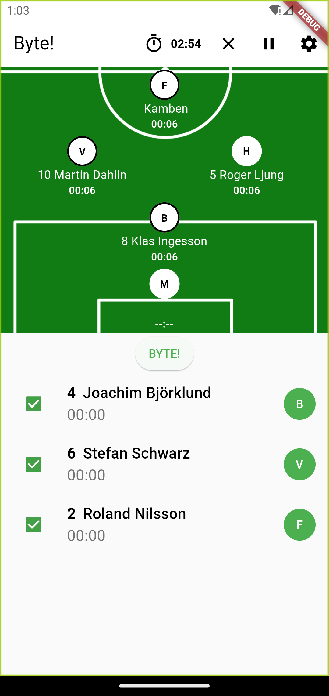

# lag_byte

Keep track of who's played the longest and at what positions. 

See it in action at [https://zoomix.github.io/flutter_byte/](https://zoomix.github.io/flutter_byte/)

## Todo

- [x] Add Person
- [x] Store Person locally
- [x] Drop Person
- [x] Rename Person to Player. Position to DiamondPosition
- [x] Select Players for match
- [ ] Edit Player
- [x] Remember positions and played time between restarts.
- [x] Reset played time
- [x] Use player jersey nr
- [x] Replace one individual player
- [ ] Set byte-reminder
- [x] On edit page, list all Players not just Non-engaged players. 
- [ ] Goalkeeper
- [ ] History of positions
- [x] Outline on players about to be replaced
- [x] Sort list of players by time played, ascending
- [x] Warn if multiple selected players have the same position
- [ ] Smarten up the suggestor
- [ ] FireBase it for shareability.

## Icons

The icon is a mashup of these two free images. Unless you think I did something bad. In that case, let me know and I'll get it fixed. 
https://pngimg.com/image/87513
<a href="http://cliparts.co">Clipart.co</a> - http://cliparts.co/clipart/2335423

## License

Choosealicense.com said glp-3.0. Read all about it [here](LICENSE.txt)
